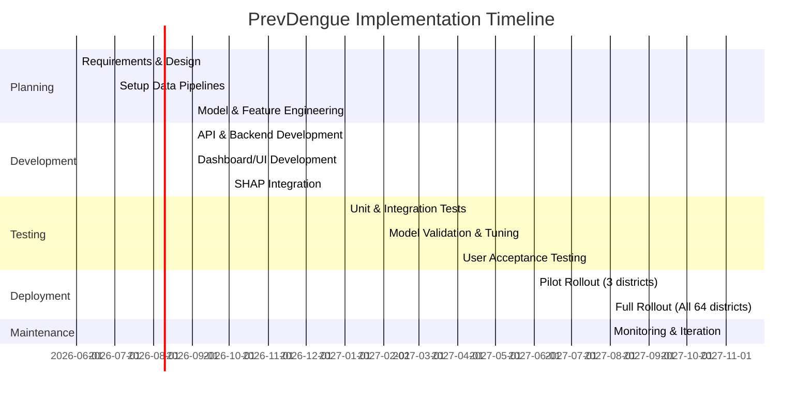

# PrevDengue: Product Requirements Document

## Executive Summary  
PrevDengue is an AI-driven early warning system to predict dengue outbreaks 2–4 weeks in advance at the district level in Bangladesh.  The impetus is the historic 2023 epidemic (321,179 cases, 1,705 deaths) affecting all 64 districts.  Most cases (63%) occurred outside Dhaka, and over two-thirds of dengue deaths happened within one day of hospital admission (signaling late-stage presentations).  PrevDengue will integrate climatic (temperature, humidity, rainfall), demographic (population density, urbanisation), environmental (land use) and historical dengue data to forecast risk by district.  It uses ensemble tree models (XGBoost/LightGBM) with lagged and aggregated features to capture delayed mosquito-transmission dynamics.  SHAP explainability will highlight drivers of risk for each district.  Outputs are delivered via a secure REST API to a web dashboard (interactive choropleth maps, trend charts, SHAP plots) and an alerting system (email/SMS) targeting DGHS officials and district hospitals.  A citizen portal (English/Bengali) allows public querying of local risk and guidance. 

PrevDengue’s goals are to provide *actionable lead time* so that fogging, resource allocation and public advisories can preempt severe outbreaks.  Success will be measured by predictive performance and system reliability: we target ≥90% accuracy (AUC >0.90) overall, recall ≥80% for *High/Critical* alerts, lead time ≥2 weeks, and >99% system uptime (API latency <200 ms).  By clearly identifying high-risk districts early (leveraging climate as a top predictor), PrevDengue empowers DGHS, hospitals and citizens to reduce avoidable severe cases and fatalities. 

## Goals & Success Metrics  
- **Forecast Horizon**: Provide reliable risk forecasts 2–4 weeks ahead of current date.  
- **Prediction Accuracy**: Aim for ≥90% overall accuracy (ROC-AUC ≥0.90) on historical outbreaks.  
- **Recall/Precision (High/Critical Alerts)**: Target ≥80% recall and ≥70% precision for districts labeled *High* or *Critical* risk (to balance false alarms vs missed outbreaks).  
- **Lead Time**: Minimum 14-day advance warning before risk peaks (target 2–4 week horizon).  
- **Geographic Coverage**: Predictions for **all 64 districts** of Bangladesh weekly, updating as new data arrive.  
- **System Availability**: ≥99% uptime (target “five 9s” in production), with automatic failover.  
- **API Performance**: REST API latency <200 ms per request under typical load; 99% of requests served within 500 ms.  
- **Data Freshness**: New model outputs generated within 24 hours of data availability each week.  
- **Alerting Timeliness**: SMS/email alerts dispatched within 1 hour of risk threshold breach.  
- **User Engagement**: ≥80% of DGHS district offices and hospitals using the dashboard weekly.  
- **User Satisfaction**: Positive feedback (>85% satisfaction) from health officials (via UAT surveys).

## User Personas & Journeys  
- **DGHS National Administrator** (English):  
  - *Role*: Directorate-level public health official (e.g. Director CDC, DGHS IT head).  
  - *Needs*: Nationwide situational awareness; identify emerging hotspots; allocate resources (medicines, hospital beds) across districts.  
  - *Journey*: Logs into PrevDengue weekly → views national map of district risks (Low–Critical) → clicks on high-risk districts to see projections and feature drivers → receives automated alerts for any *High/Critical* risks (SMS/email) → convenes inter-district coordination meeting to plan interventions.  

- **District Hospital Administrator / Civil Surgeon** (English/Bengali):  
  - *Role*: District health leader managing local hospital capacity.  
  - *Needs*: Advance notice of local outbreaks; capacity planning (beds, staff) and vector control (fogging) coordination.  
  - *Journey*: Receives email/SMS alert when their district risk becomes *High/Cr* → logs into district dashboard → checks weekly trend of dengue cases vs forecast (line chart) and local SHAP feature bar (e.g. heavy rainfall) → updates hospital surge plan, pre-allocates beds, mobilises vector control teams and media advisories in Bengali.  

- **General Public (Citizen)** – *Bengali and English*:  
  - *Role*: Concerned resident or traveller.  
  - *Needs*: Simple risk indicator for home district; preventive guidance.  
  - *Journey*: Visits PrevDengue public portal, selects district (or auto-detect via IP) → sees current risk level and brief advisory (“Low, continue normal vigilance” or “High: use nets, remove standing water, seek care if febrile”) in preferred language → optionally signs up for SMS alerts about critical risks.  

## Functional Requirements  

- **Data Ingestion & ETL**: 
  - Ingest weekly dengue case counts by district from DGHS surveillance (hospital reports, MIS). If hospital-level data available, aggregate by district. 
  - Acquire daily/weekly climate data: temperature, humidity, rainfall (from Bangladesh Meteorological Dept or open APIs). Use satellite (NASA GPM/IMERG) for rainfall to ensure nationwide coverage. 
  - Obtain static socio-demographic/geographic data: district population (density, urban % from BBS census or WorldPop), land use (agriculture/urban fraction). 
  - Standardise and validate inputs: handle missing data (interpolate weather gaps; use previous year averages if current data lag). Log data quality issues. Ensure all sources map to consistent district codes and calendars.  

- **Feature Engineering**: 
  - Compute time-lagged climate features: e.g. average temperature/humidity and total rainfall for 1–4 weeks prior (lag1–lag4). 
  - Rolling aggregates: e.g. cumulative rainfall in past 2–4 weeks.  
  - Binary flags: e.g. humidity above threshold, onset of monsoon.  
  - Autoregressive terms: recent dengue incidence (previous week(s) cases) per district. 
  - Demographic factors: population density, urbanisation index, percentage of land under agriculture (district-level).  
  - Seasonal/time features: month, week-of-year to capture seasonality.  
  - Normalize/scale features as needed; create training dataset merging all features with target.  

- **Model Training & Validation**:  
  - **Algorithms**: Train ensemble of XGBoost and LightGBM decision-tree models (for robustness). Combine via weighted average or voting.  
  - **Training Data**: Historical data 2000–2025 (or latest), stratified by district-week. Label target as “outbreak risk” (e.g. classify if cases exceed district-specific threshold) or predict weekly case count.  
  - **Cross-validation**: Time-series split (e.g. expanding window) to avoid leakage. Hold out most recent year(s) for final validation.  
  - **Hyperparameter Tuning**: Use grid search or Bayesian optimisation on number of trees, depth, learning rate, etc.  
  - **Baseline Models**: Simple autoregressive (ARIMA) or logistic regression as benchmarks.  
  - **Evaluation Metrics**: ROC-AUC, F1-score, precision & recall (especially for High/Critical class), mean absolute error (for counts).  
  - **Calibration**: Apply probability calibration (e.g. isotonic) to ensure risk scores correspond to true outbreak likelihoods.  
  - **Retraining Cadence**: Retrain models monthly or after each dengue season, especially if model drift is detected.  

- **Explainability (SHAP)**:  
  - Compute SHAP values for each prediction to identify feature contributions (global and per-instance).  
  - For each district-week, output top feature influences on risk score (e.g. “lagged rainfall +0.3”, “humidity +0.2”, “pop density +0.1”).  
  - Expose this in the UI: bar charts of top positive/negative factors. Allow users to see which climate or sociodemographic drivers were most influential.  

- **Risk Scoring & Classification**:  
  - Translate model output (probability or score) into risk categories: **Low, Medium, High, Critical** (e.g. by pre-defined probability thresholds).  
  - Define thresholds in consultation with DGHS (e.g. top 5% of predicted risk as Critical, next 10% High, etc, or fixed cutoffs based on calibration).  
  - Compute a “risk score” (0–1) for each district-week. Map to categories.  

- **Forecasting (2–4 weeks ahead)**:  
  - Generate rolling forecasts: the model predicts risk for weeks +2 to +4 from “today”. (E.g. each Monday forecast next 1–4 weeks).  
  - Update forecasts weekly as new data arrive.  
  - Store multi-week forecast trajectory per district.  

- **REST API**:  
  - Expose endpoints for retrieving current and forecast data. Example endpoints:  
    - `GET /api/v1/risk?district={name}` – returns current risk level, score and forecasts for next weeks.  
    - `GET /api/v1/trends?district={name}` – returns time series of past cases and forecast values.  
    - `GET /api/v1/feature-shap?district={name}&week={date}` – returns SHAP feature contributions.  
  - **Example Response (JSON)**:  
    ```json
    {
      "district": "Dhaka",
      "current_risk": "High",
      "current_score": 0.82,
      "forecast_weeks": ["High","Critical","Critical","High"],
      "shap_top_features": {
         "rainfall_lag3": 0.35,
         "humidity": 0.22,
         "cases_lag1": 0.18,
         "pop_density": 0.10
      }
    }
    ```  
  - Implement authentication (API keys or OAuth2 tokens) for DGHS/hospitals; public endpoints (like citizen view) are read-only.  
  - Ensure versioning (`/v1/`) for future changes.  

- **Dashboard Features**: 
  - **Interactive Map (Choropleth)**: Bangladesh map with districts coloured by risk category (Low green to Critical red). Hover shows numerical risk score and trend. Zoom/pan to view divisions.  
  - **District Trend Charts**: On selecting a district, display line charts of past dengue cases and forecast. Include two axes: observed case counts (bar/line) and predicted risk level.  
  - **SHAP Feature Plot**: Bar chart of top positive/negative feature contributions for selected district-week.  
  - **Alerts Inbox**: List of active alerts (district, risk, date). Clickable to view details.  
  - **Language Toggle**: All dashboards and guidance text available in English and Bengali.  
  - **User Roles**: DGHS national view sees all districts; district admin sees only their own district(s). Citizens see read-only national view.  
  - **Download/Export**: Option to export summary reports (PDF/CSV) per district for offline analysis or press release.  

- **SMS/Email Alerting**:  
  - **Trigger Conditions**: When a district’s risk score transitions into *High* or *Critical* category (or stays there for 2 consecutive forecasts).  
  - **Recipients**: DGHS HQ officials (Director of CDC, IEDCR head), Divisional and District Civil Surgeons, Hospital Directors.  
  - **Content Template**: E.g. 
    - **Email Subject**: “Dengue Alert: [District] – [Risk Level] (Forecast [Date])”  
    - **Email Body**: “PrevDengue predicts [District] will have [High/Critical] dengue outbreak risk from [date range]. Key drivers: [feature1], [feature2]. Recommended actions: activate fogging teams, allocate extra beds, issue community advisory.”  
    - **SMS**: Short alert (“Dengue *Critical* risk in [District] next 2wks per forecast. Prep hospitals, escalate vector control.”)  
  - **Escalation**: If no acknowledgment from district after initial alert (within 24h), escalate to Divisional DGHS and Ministry (as per SOP).  

- **Citizen Portal**:  
  - **Public Dashboard**: Simplified interface for lay users. Shows a map or selector for districts; clicking a district shows “Current Risk: [Low/Med/High/Critical]” and an icon-based action list (e.g. use nets, remove water, see doctor).  
  - **Localization**: Full Bengali interface and content.  
  - **Risk Subscriptions**: Option for citizens to sign up for SMS/WhatsApp alerts for their district.  

- **Role-Based Access Control (RBAC)**:  
  - **Roles**: _Admin_ (DGHS national-level), _DistrictManager_ (district-level health admin), _Viewer_ (citizen).  
  - **Permissions**: Admin can configure thresholds, manage users, view/edit all data; DistrictManager views local data and reports; Viewer sees only public dashboards.  
  - **Authentication**: DGHS users login with official email credentials (likely via SSO). Citizen portal has no login.  

- **Localization**:  
  - UI and all static content in English and Bengali. Use standard date/time formats (DD-MM-YYYY, 24-hr).  
  - Support Unicode (UTF-8) for Bengali script. Provide translated tooltips and error messages. 

## Non-Functional Requirements  

- **Scalability**: System must handle daily ingestion of national data and thousands of concurrent users. Design horizontally scalable architecture (e.g. containerized microservices, load balancing).  
- **Availability**: Target 24/7 availability (except scheduled maintenance). Use redundant servers and database replicas (multi-AZ cloud setup). Disaster recovery plan with failover cluster.  
- **Performance**: End-to-end data-to-forecast pipeline should update within 6–12 hours of data receipt. API endpoints respond <200 ms. Frontend should load <3 seconds on standard connections.  
- **Security**: All data in transit must use TLS. Apply OWASP best practices for web app. Secure data stores (encrypted at rest). Use role-based auth and audit logs for sensitive actions.  
- **Data Privacy & Compliance**: Handle personal data cautiously. The system will mainly use aggregated case counts (no patient identifiers). Comply with Bangladesh data protection regulations (e.g. Digital Security Act provisions). Since BMD climate data is regulated, ensure proper procurement/licensing for official data.  
- **Reliability & Monitoring**: Implement logging and monitoring (e.g. Elasticsearch, Prometheus). Track system health (CPU, memory) and application errors. Set alerts on model-prediction drift (e.g. ROC-AUC drop).  
- **Maintainability**: Document codebase, APIs, and runbooks. Modular design for ease of updates (e.g. plug-in new models, add districts). Version control for data and models.  
- **Backup & Recovery**: Daily backups of databases (cases, models, logs). Test restore procedures quarterly. Maintain at least 1-month data-retention online, 1-year offline archive.  
- **Standards & Interoperability**: Use REST and JSON. Follow ICD-10/BHIS codes for diseases if applicable. Use ISO country codes for districts.  

## Data Requirements & Inventory  

| **Data Source**                       | **Type**                    | **Fields/Variables**                                     | **Frequency**    | **Usage**                                     |
|--------------------------------------|-----------------------------|----------------------------------------------------------|------------------|-----------------------------------------------|
| **DGHS Dengue Surveillance (MIS)**   | Case reports                | Patient ID; Age; Sex; Hospital; District; Date; Outcome (case/death) | Daily/Weekly (target)| Historical case counts by district-week for training and monitoring. |
| **Meteorological Dept (BMD)**        | Observations (station)      | Max/Min Temp; Humidity; Rainfall; Precipitation; Wind    | Hourly/Daily (fee-based)| Climate features (lagged temp, humidity, rainfall) per region. |
| **Satellite (NASA GPM/IMERG)**       | Precipitation estimates     | Gridded rainfall mm (30-minutes, aggregated daily)       | Half-hourly (global)| Nationwide rainfall (for districts lacking station data). |
| **Bangladesh Bureau Stats (BBS)**    | Census & population         | Total pop, Density; Urban %; Age distribution (2021 census)| Decadal (2022, 2011) | District population & urbanization features (static). |
| **WorldPop Population Grids**        | Population (raster)         | Pop per km² (100m grid)                                  | Annual (estimates) | Cross-verify density; derive urban hotspots. |
| **Land Use/Land Cover (GlobCover)**  | Satellite land cover        | %Agricultural, %Urban, %Water (per district)            | Annual (2015)     | Environmental risk factors (breeding habitats). |
| **Healthcare Capacity (DGHS)**       | Hospital infrastructure     | Number of hospitals/beds per district                   | Irregular        | (Optional) Adjust for local healthcare strain. |
| **District Boundaries**              | GIS shapefiles             | District polygons (ISO codes)                           | Static           | Geospatial mapping for choropleth. |
| **Weather Forecasts (3-week)**      | Predicted climate (optional) | Forecast Temp/Rain/Humidity                            | Weekly (outlook) | (Optional) For more precise 2–4 week forecasts. |
| **Case Reporting Metadata**         | System logs                 | Timestamps of data receipt                              | Ongoing          | Monitor reporting delays & data quality. |

*Notes/Assumptions*: We assume DGHS can provide at least weekly aggregated dengue counts per district; if detailed patient data is unavailable, use published aggregate bulletins. Station-based weather may have gaps; use satellite GPM as backup. Population/Land-use may be dated; assume slow change. Unspecified fields (e.g. patient address granularity) will default to district-level only. For new serotype/viral changes, system treats as implicit via case data.

## ML Design  

- **Model Architecture**: Ensemble of XGBoost and LightGBM classifiers/regressors. These gradient-boosted decision-tree models handle complex nonlinearities and are computationally efficient for tabular data.  
- **Feature List**:  
  - Climate lags: Temperature (min, max, mean) and relative humidity at lags 1–4 weeks.  
  - Precipitation features: Total rainfall in past 1, 2, 4 weeks; number of heavy-rain days; monsoon onset flag.  
  - Historical incidence: Dengue case counts at lags 1–4 weeks (auto-regressive terms).  
  - Demographics: District population, population density, percent urban, poverty index (if available).  
  - Land use: % agricultural land, % water bodies (proxy for breeding habitat).  
  - Spatial features: e.g. neighboring-district cases (optional for spatial dependence).  
  - Seasonal terms: Week of year (to capture seasonality).  
- **Target Definition**: Two possible targets: (1) binary classification of “outbreak occurrence” (e.g. case count exceeding a threshold) for next week(s); or (2) continuous forecast of weekly case count. We focus on risk classification because actionable alerts (High/Critical) are thresholds.  
- **Training Strategy**:  
  - Historical data split by time (e.g. train on 2000–2021, validate 2022–2023). Ensure no leakage.  
  - Time-series cross-validation: sliding window validation (train on years up to N, test on N+1).  
  - Perform hyperparameter tuning via grid search (trees, depth, learning rate).  
  - Use class weighting or oversampling if High/Critical events are rare to improve recall.  
- **Baseline Models**: Include simple baselines: Naïve (last-year same-week cases), and a Poisson regression using climate terms, to benchmark gains from ML.  
- **Evaluation Metrics**:  
  - *Classification*: ROC-AUC, Precision, Recall, F1-score (with emphasis on recall of High/Critical).  
  - *Regression (if used)*: RMSE, MAE.  
  - Compare model performance to historical outcomes (back-testing). Target ROC-AUC ≥0.90, and recall >0.8 for critical events.  
- **Calibration & Drift**: Regularly check calibration (e.g. Brier score) and retrain if performance degrades (concept drift, e.g. new serotypes or urbanization changes). Monitor feature importance shifts.  
- **Retraining Cadence**: Update models annually (post-monsoon season) or more frequently if outbreak occurs off-season.  

## Explainability & Interpretability  
- Compute **SHAP (Shapley) values** for each model prediction to quantify feature impact (positive or negative) on the risk score.  
- In the dashboard, present SHAP bar charts: top 5 factors driving the current risk in a district (e.g. “Lagged rainfall: +0.35”, “Humidity: +0.22” etc.).  
- Provide global summary charts (e.g. feature importance heatmap) to help scientists and officials understand long-term drivers (confirming e.g. climate as dominant factor).  
- Enable “What-if” exploration (advanced feature): allow domain experts to adjust a feature (e.g. simulate extra rainfall) and see how predicted risk changes.  

## API & Data Schema  

- **Authentication**: OAuth2/JWT for internal users; API keys for programmatic access. Use HTTPS.  
- **Endpoints (examples)**:  
  - `GET /api/v1/risk?district=Dhaka&weeks_ahead=4` – returns current and next 4-week risk levels and scores.  
  - `GET /api/v1/cases?district=Dhaka&since=2026-01-01` – historical case series.  
  - `POST /api/v1/ingest` – (internal) upload new data for retraining.  
- **Request/Response Schema**: JSON, e.g.:  
  ```json
  {
    "district": "Dhaka",
    "date": "2026-06-21",
    "current_risk": "High",
    "score": 0.78,
    "forecast": [
       {"week": "2026-06-28", "risk": "High", "score": 0.81},
       {"week": "2026-07-05", "risk": "Critical", "score": 0.92}
    ],
    "explanations": {
       "rainfall_lag3": 0.35,
       "humidity": 0.22,
       "cases_lag1": 0.18
    }
  }
  ```  
- **Throttling & Load**: Limit to reasonable queries per user (e.g. 100 req/min).  
- **Error Handling**: Return HTTP 4xx/5xx with JSON error messages. Validate inputs (e.g. district names).  

## UI/UX Screens & Visualisations  

| **Screen**                  | **Audience**         | **Key Elements & Visualisations**                                                                 |
|-----------------------------|----------------------|--------------------------------------------------------------------------------------------------|
| **National Risk Map**       | DGHS Admin           | Choropleth map of Bangladesh (64 districts) color-coded by risk.  Legend and filter (week).  Summary stats (total districts High/Critical). |
| **District Detail**         | DGHS & District Admin| Time series chart: past dengue cases (bars) and predicted risk (line) over time. SHAP bar chart: top contributing factors.  “Indicators”: current population density, rainfall, etc. |
| **Alerts Dashboard**        | DGHS & District Admin| Table/list of active alerts by district (status, risk level, date). Action buttons (Acknowledge, View Details). |
| **Citizen Portal**          | Public (All)         | Simplified map or dropdown of districts. Display: *“Current Risk: [colour/star]”* and a brief advisory message. Option to subscribe to SMS. Fully Bengali interface. |
| **Admin Settings**          | DGHS Admin           | Interface for managing users, configuring risk thresholds, updating model parameters.               |

Each screen uses responsive design (desktop/mobile), with clear legends and hover tooltips. Colourblind-friendly palette (e.g. green→red for Low→Critical). Include export buttons (CSV/PDF) for charts. Provide in-app help (tooltips) explaining metrics and actions.  

## Alerting Rules & Operational Playbooks  

- **Risk Thresholds**: Pre-defined cutoffs for risk categories (e.g. score>0.8 → Critical). Thresholds validated with historical data and DGHS experts.  
- **Alert Criteria**: Generate alert when a district’s risk reaches *High* or *Critical*. Include an alert if risk jumps by >1 category week-over-week.  
- **Escalation Path**:  
  - Initial alert: sent to District Civil Surgeon, Divisional DG.  If no response in 24h, escalate to Directorate CDC and Ministry.  
  - Weekly review: DGHS CDC convenes emergency meeting if ≥5 districts Critical.  
- **Notification Templates**: Pre-written SMS/Email with placeholders: district, risk level, week range, top factors, recommended actions. Tested for clarity in English/Bengali.  
- **Standard Operating Procedures (SOPs)**:  
  - *DGHS*: Upon alert, DGHS should allocate additional test kits and IV fluids to the district, coordinate with LGED for fogging. Publish press release through HEOC.  
  - *District Hospital*: Activate dengue corners, stock platelets and saline, alert community health workers. Display warning signs at clinics.  
  - *Vector Control Teams*: Use alert to prioritize fogging and larvicide in high-risk neighborhoods (especially stagnant water).  
  - *Community Engagement*: Draft local media messages (via radio, social media) using system data. Example: “PrevDengue forecast shows High dengue risk in [District] next fortnight – remove water pools and use mosquito nets.”  

## Deployment & Infrastructure  

- **Cloud Option** (preferred): Use a major cloud provider (AWS/GCP/Azure) for flexibility. Example architecture: Kubernetes cluster (EKS/GKE) hosting microservices, PostgreSQL (RDS) for data, Redis cache, Nginx load balancer.  
- **On-Prem Option**: Deploy on DGHS data center using Docker containers managed by Kubernetes/Swarm. Ensures data sovereignty.  
- **Containerization**: All components (ETL scripts, ML service, API, frontend) packaged as Docker images. CI/CD pipeline via GitLab/GitHub Actions to build/test/deploy on commit.  
- **CI/CD**: Automated tests on code push; staging environment for UAT; blue-green or rolling deployment for production.  
- **Infrastructure as Code**: Use Terraform/CloudFormation to define servers, networking. Version control for infra config.  
- **Backup & Recovery**: Automatic nightly database snapshot (multi-region). Store 30-day and 1-year backups.  
- **Cost Estimates** (cloud, assuming moderate usage): ~US$10k–30k/year including compute, storage, SMS service charges. On-prem reduces cloud fees but adds hardware costs (assume equivalent).  
- **Monitoring & Logging**: CloudWatch/Stackdriver for host metrics, ELK or Prometheus/Grafana for app logs, alerts on failure.  

## Testing & Validation Plan  

- **Unit Tests**: For each module (data parsers, feature pipelines, API). Achieve >80% code coverage.  
- **Integration Tests**: Simulate end-to-end workflows: ingest sample data, run model, check API outputs.  
- **Model Validation**: Backtest forecasts on withheld historical data (2019–2023). Check that performance targets are met. Recalibrate if needed.  
- **Performance Testing**: Load-test API to ensure 200 ms latency at peak load. Stress-test dashboard UI with hundreds of concurrent users.  
- **User Acceptance Testing (UAT)**:  
  - Involve a pilot group (IEDCR analysts, district health officers) to use the system and provide feedback.  
  - Validate that features (map, charts, alerts) meet user needs; refine UI/UX.  
- **Pilot Rollout**: Phased launch starting with a few districts (e.g. Dhaka, Chittagong, Khulna) for 1-2 months. Monitor operations, fix issues.  
- **Full Rollout**: Expand to all districts after successful pilot (ensuring local teams are trained).  
- **Documentation**: Provide test reports and sign-off from DGHS for each phase.  

## Maintenance, Governance, and Roles  

- **Ownership**: DGHS (IEDCR/CDC) is product owner. A designated “PrevDengue Team” (possibly in partnership with a tech contractor) maintains models and code.  
- **Data Governance**:  
  - *DGHS* owns case data; provides weekly updates.  
  - *BMD* owns meteorological data (ensure licensing).  
  - Data stewards assigned for each source (e.g. MIS manager, climate analyst).  
- **Model Governance**: Annual review by a multidisciplinary committee (epidemiologists, data scientists) to approve model updates and validate performance.  
- **Alerts & Contacts**: Maintain updated contact list of all district health officers and DGHS leads. Update via quarterly review.  
- **User Training**: Conduct workshops for DGHS and district staff (covering dashboard, interpretation, SOPs). Provide training materials and helpdesk support.  
- **System Admin**: On-call engineer for incident management; schedule monthly health checks. Update OS/software patches regularly.  
- **Documentation**: Maintain a living wiki with data schemas, API docs, SOPs for alerts, user guides (in English/Bengali).  

## Risks, Assumptions, Dependencies  

- **Data Delays**: Risk that DGHS case reporting is late or incomplete. *Mitigation*: Build data validation checks; use missing-data imputation (e.g. carry-forward averages).  
- **Reporting Bias**: Urban hospitals report more reliably than rural ones, possibly undercounting rural dengue. *Assumption*: Use calibration or auxiliary proxies (e.g. Google Trends, if available).  
- **Weather Forecast Uncertainty**: Climate drivers may deviate unexpectedly. *Mitigation*: Our model focuses on observed climate rather than forecast to avoid compounding errors; mention uncertainty in alerts.  
- **Concept Drift**: Viral evolution or vector control changes could alter patterns. *Mitigation*: Monitor model accuracy continuously and retrain after each season.  
- **Regulatory Changes**: Meteorological data access is legally constrained. *Assumption*: Budget allocated to pay for official weather data or rely on open-source satellite data.  
- **Technical Dependencies**: Dependence on third-party APIs (SMS gateway, Google Maps). Use multiple providers or fallbacks.  
- **User Adoption**: Risk that stakeholders may ignore system. *Mitigation*: Involve DGHS from design stage, align with national dengue response plans.  
- **Infrastructure Outages**: Cloud provider downtime. *Mitigation*: Multi-zone deployment, backup plan (e.g. failover to alternate region).  

## Timeline & Milestones  



## Data-to-Alert Pipeline Flow  

```mermaid
flowchart LR
    subgraph Data Sources
      A[DGHS Case Data] 
      B[BMD Station Weather] 
      C[NASA GPM Rainfall] 
      D[Population/Land-use]
    end
    A --> ETL[ETL & Data Warehouse]
    B --> ETL
    C --> ETL
    D --> ETL
    ETL --> Features[Feature Engineering]
    Features --> Model[ML Models (XGBoost/LightGBM)]
    Model --> Scoring[Risk Scoring & Classification]
    Scoring --> API[REST API Server]
    API --> Dash[Dashboard/UI]
    API --> Alert[Alert System (Email/SMS)]
    Dash --> User[DGHS & District Users]
    Alert --> User
    API --> Citizen[Public Portal]
```

## Appendix: Key Data & Reference Sources  

- **DGHS (Bangladesh)** – Official Health Information System (DHIS2/MIS) for dengue case reports; Daily dengue bulletins.  
- **DGHS Guidelines & Reports** – e.g. dengue clinical guidelines, IEDCR surveillance protocols.  
- **Bangladesh Meteorological Department (BMD)** – Climate data portal (historical weather; regulatory data access terms).  
- **NASA GPM (IMERG)** – Global satellite precipitation dataset (2000–present).  
- **Bangladesh Bureau of Statistics** – Population census 2022, urban/rural breakdown.  
- **WorldPop** – High-resolution population density/urbanization grids for Bangladesh.  
- **WHO Outbreak Reports** – Dengue situation updates (Bangladesh 2023).  
- **Peer-Reviewed Studies** – Bangladesh dengue prediction research: e.g. TropicalMed 2026 (ML + XAI), PLOS One 2024 (climate drivers).  
- **Meteorological & Environmental Data** – MODIS/ESA land cover for land use patterns; BMD weather forecast (optional).  

Each source will be consulted to refine data integration, feature selection, and ensure alignment with national health policies. The above constitutes an initial prioritization of authoritative inputs.

